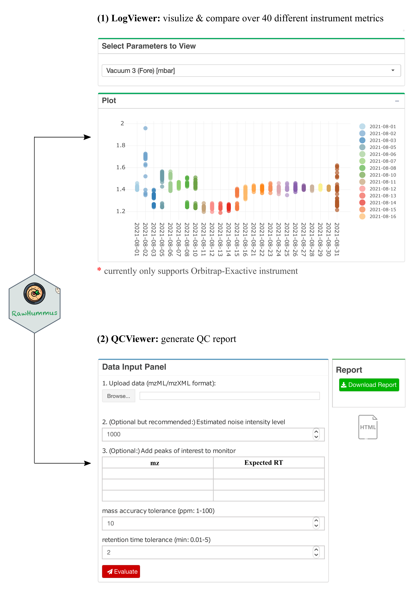

```{r, include = FALSE}
knitr::opts_chunk$set(
  collapse = TRUE,
  comment = "#>"
)
```

RawHummus is an R Shiny app for assessing LC–MS system performance by visualizing instrument log files and monitoring raw quality control samples within a project.

**Figure 1.** Overview of the main functions in RawHummus

<br></br>



<br></br>

**Table 1.** Overview of quality metrics used in RawHummus report

| Section      | Metric                                                      | Explanation                                                                                                                                                                                                                                            |
|--------------|-------------------------------------------------------------|--------------------------------------------------------------------------------------------------------------------------------------------------------------------------------------------------------------------------------------------------------|
| **Chromatogram** |                                                             |  
|                  | TIC plot                                                    | It is total ion current at each scan plotted as an intensity point for each raw file. Overlaid TIC plot is used for rapid inspection of RT and ion intensity fluctuations.                                                                             
|              | Summed TIC bar plot                                         | It is summed TIC of all scans in a raw file. It is used to check global ion intensity variations among raw files.                                                                                                                                      |                                                                                                                                                                                                                                           
|              | TIC correlation analysis                                    | Pairwise Pearson correlation analysis of raw files. It is used to evaluate chromatogram similarity, i.e., peak shape similarity and RT shift. Pearson correlation coefficient above 0.85 indicates that the two raw files are similar.                                                                                                                                                                                                                                                                                                                                 
|              | Max. mass difference (ppm)                                  | It is maximum m/z variation among each selected mass feature across all the raw files. It is used to evaluate the mass accuracy. If the max. mass difference is over 5 ppm, this value will be highlighted in red.                                     
| **MS1**     |                                                             |                                                                                                                                                                                                                                                        
|              | Max. RT difference (min)                                    | It is maximum retention time variation among each selected mass feature across all the raw files. It used to evaluate RT shifts. If the max. RT difference is over 1 min, this value will be highlighted in red.                                                                                                                                                                                                                                                                                             
|              | Max. intensity fold change                                  | It is the maximum intensity fold change among each selected mass feature across all the raw files. It is used to evaluate ion intensity variation. If max. intensity fold change is over 1.5, this value will be highlighted in red.                   |                                                                                                                                                                                                                                                   
|              | Intensity CV (%)                                            | It is intensity coefficient of variance (or relative standard deviation, RSD) of each selected mass feature across all the raw files. It is used to evaluate intensity variation. If intensity CV is over 30%, this value will be highlighted in red.  |
| **MS2**      |                                                             |                                                                                                                                                                                                                                                        
|              | No. of MS2 events                                           | It is number of triggered MS/MS spectra per file. It is used to evaluate MS2 event                                                                                                                                                                     
|              | Precursor ion distribution across mass plot                 | It is density plot of the precursor ion across mass range based on the triggered MS/MS events.                                                                                                                                                      
|              | Precursor ion distribution across RT plot                   | It is density plot of the precursor ion across RT range based on the triggered MS/MS events.                                                                                                                                                           |
|              | Cosine similarity of precursor ion distribution across mass | It measures the similarity of precursor ion distribution across mass. Cosine similarity score above 0.85 indicates that the precursor distributions across mass are similar between two files.                                                                                                                                                                                                                                                                                                                                                                  
|              | Cosine similarity of precursor ion distribution across RT   | It measures the similarity of precursor ion distribution across mass. Cosine similarity score above 0.85 indicates that the precursor distributions across RT are similar between two files.                               

## Installation

```{r eval = FALSE}
install.packages('RawHummus')
```

## Usage

Run the following script, the Web App will pop up and you can then enjoy using RawHummus.

```{r eval = FALSE}
library(RawHummus)
run_app()
```

## Citation

If you find this shiny App usful, please consider citing it:

Dong, Y., Kazachkova, Y., Gou, M., Morgan, L., Wachsman, T., Gazit, E. and Birkler, R.I.D., 2022. RawHummus: an R Shiny App for Automated Raw Data Quality Control in Metabolomics. Bioinformatics.
